# Лабораторна робота 1. Робота з СУБД PostgreSQL та основи SQL

## Студентка: Старикова Юлія
## Група: ІПЗ-32  

# Рівень 1 - Основні SELECT запити

## 1.1 Основні SELECT запити

### 1.1.1 Отримати всі записи з таблиці customers  

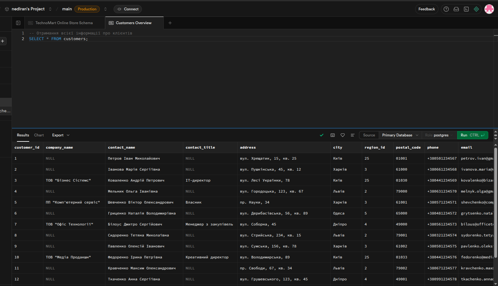

### 1.1.2 Вивести тільки назви товарів і їхні ціни з таблиці products  

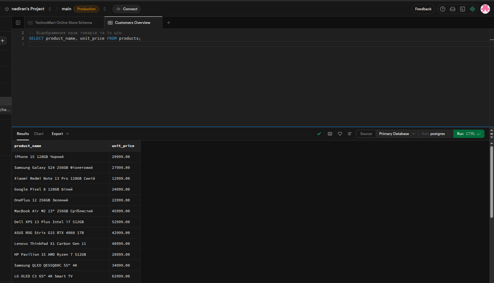

### 1.1.3 Показати контактні дані всіх співробітників (ім'я, прізвище, телефон, email)  

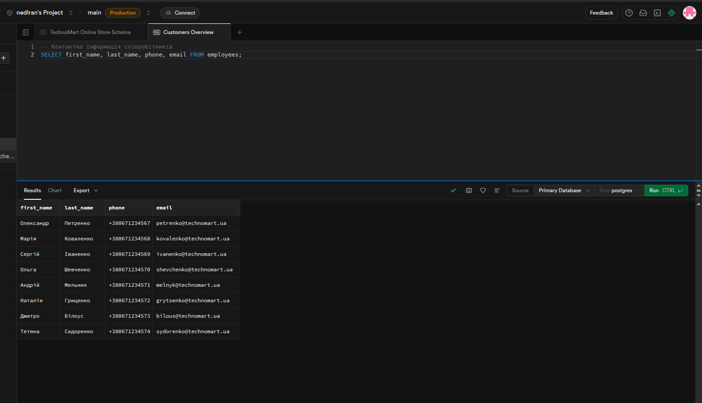

## 1.2 Умови фільтрації

### 1.2.1 Знайти всіх клієнтів з міста Київ  

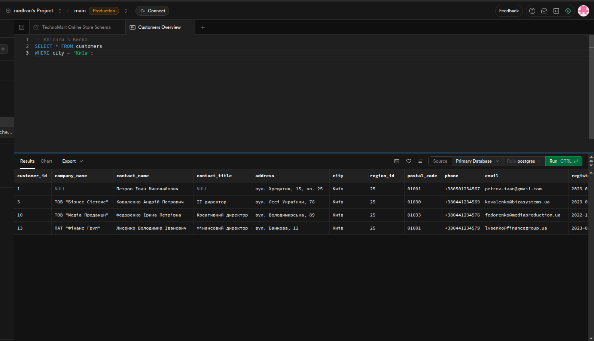

### 1.2.2 Вивести товари, які коштують більше 25000 грн  

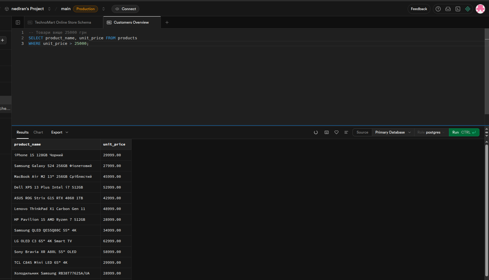

### 1.2.3 Показати всі замовлення зі статусом 'delivered'  

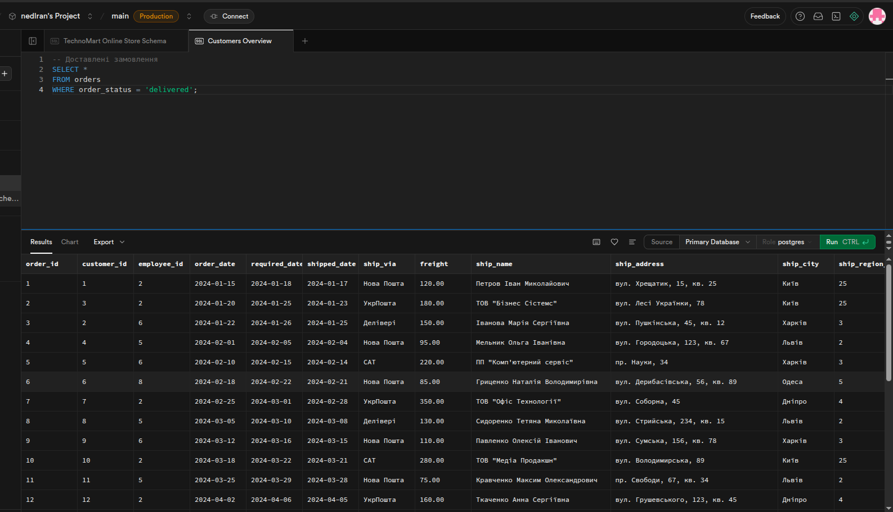

### 1.2.4 Знайти співробітників, які працюють у відділі продажів  

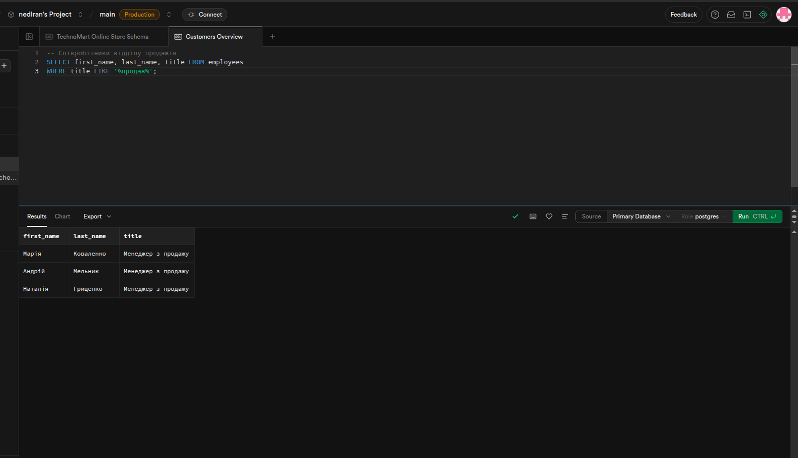

## 1.3 Базове сортування ORDER BY

### 1.3.1 Відсортувати товари за зростанням ціни  

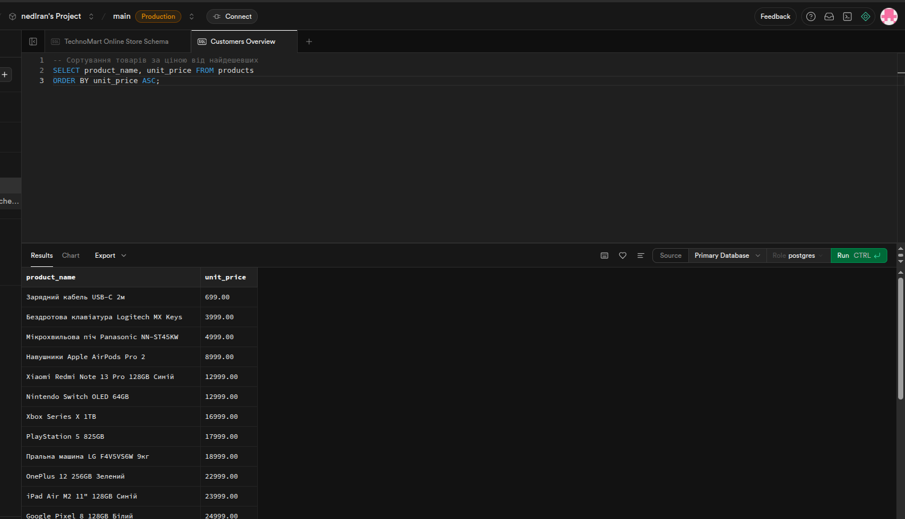

### 1.3.2 Показати клієнтів в алфавітному порядку за іменем контактної особи  

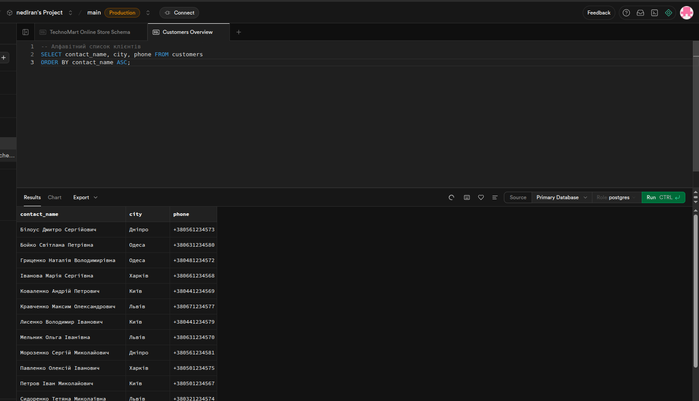

### 1.3.3 Вивести замовлення від найновіших до найстаріших  

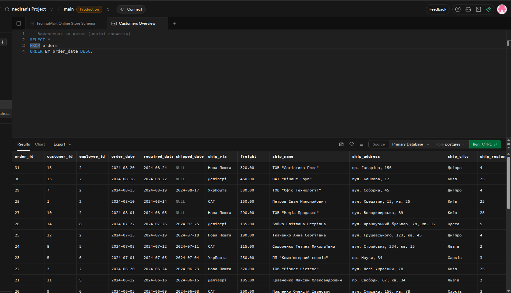

## 1.4 Обмеження результатів LIMIT

### 1.4.1 Показати перші 10 найдорожчих товарів  

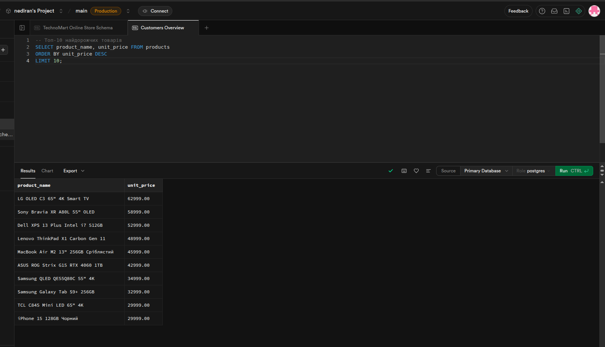

### 1.4.2 Вивести 5 останніх замовлень (за датою)  

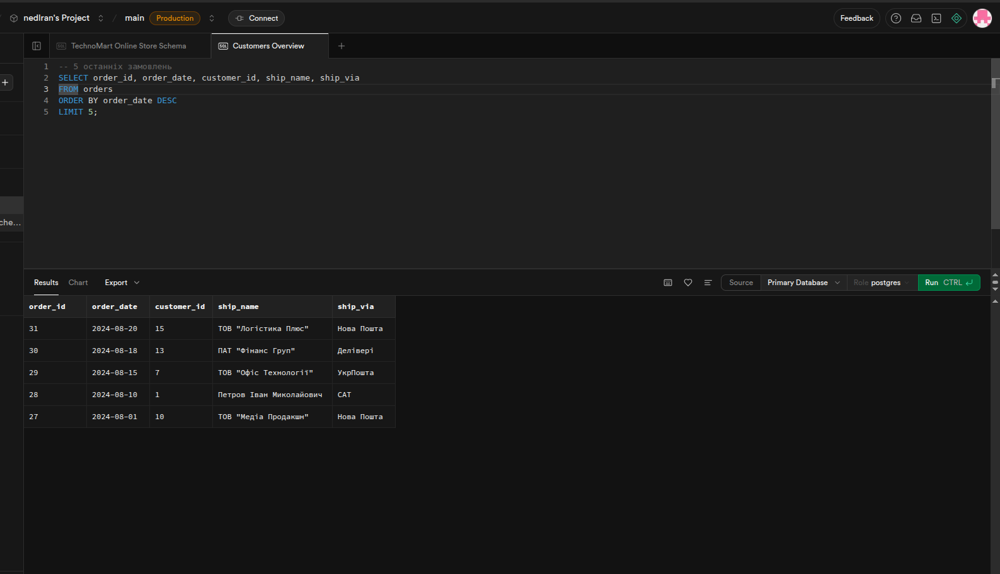

### 1.4.3 Отримати перших 8 клієнтів в алфавітному порядку  

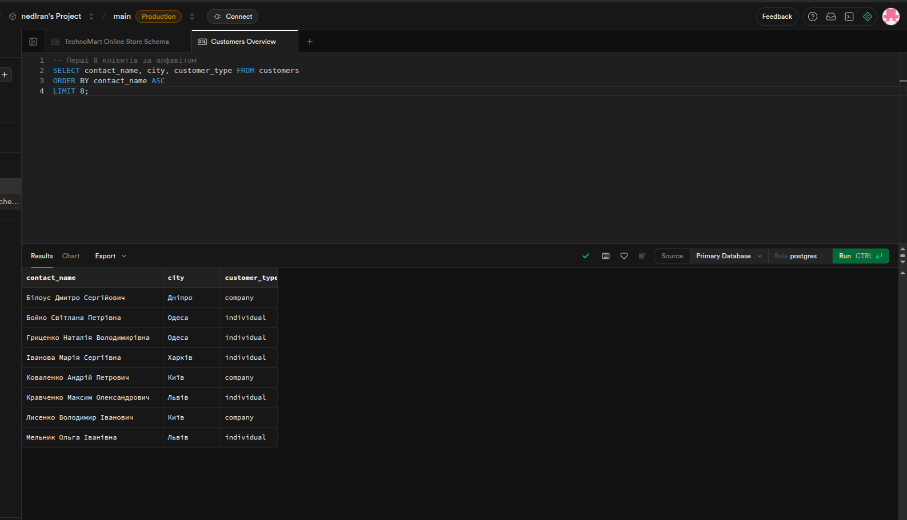

---
